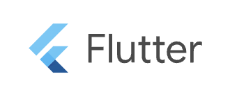

[![Contributors][contributors-shield]][contributors-url]
[![Forks][forks-shield]][forks-url]
[![Stargazers][stars-shield]][stars-url]
[![Issues][issues-shield]][issues-url]
[![Apache V2 License][license-shield]][license-url]

<!-- PROJECT LOGO -->
 

    
  <h3 align="center">Privtatize AI</h3>
  

    A customizable white-label Flutter application for enterprises, powered by Azure ChatGPT Client, designed for easy adaptation and use.
     
    <a href="https://github.com/hamatz/privtatize_ai/issues">Report Bug</a>
    ·
    <a href="https://github.com/hamatz/privtatize_ai/issues">Request Feature</a>
  

<!-- ABOUT THE PROJECT -->
## About The Project

Privtatize AIは、ChatGPT等へのアクセスが制限されているような企業の方々が、多くの費用をかけることなく社員向けのAIチャット環境を構築できるようにすることを目的とした、ホワイトレーベルのモバイルアプリーケーション開発のためのプロジェクトです。Flutterを利用することで、iOSとAndroid向けのアプリケーションを１ソースで開発できるようにしています。これまで、Webベースの企業向けソリューションはいくつか目にしてきましたが、普段から手元にPCを置いて仕事をしているわけではない方や、業務の都合上、接続先が限定的なネットワークしか利用できないような方々も多くいらっしゃり、モバイル利用の需要は低くないものと考えています。

Bring Your Own AI と言う言葉も目にするようになってきました。

そうした方々が気軽にChatGPTの恩恵を受けられるような形を作れないか？それが本プロジェクト開設のモチベーションです。

画像素材の置き換えや、ヘッダー等のデザイン差し替えによってそれぞれの企業が自社のブランドイメージに合わせて展開することを予め想定しており、そのため本プロジェクトが提供するアプリケーションはプレーンなデザインとなっています。ご自由に改編し、ご利用ください。

### 使い方

Azure OpenAI Serice上でAPI Key等をご準備頂き、それをアプリケーション上で設定いただくことで利用可能となります。必要となる情報は以下のとおりです。

1. api_key : API利用のためのアクセストークン 
2. api_base : Azure OpenAI Service上の自社向けに用意された環境の "openai.azure.com"の前に表示されている文字列。"https://docs-test-001.openai.azure.com/" であれば "docs-test-001" 
3. api_version : Azure OpenAI Service上の自社環境に展開されているAPIのバージョン。 "2023-05-15"など 
4. model_name : チャットで利用するエンジン Azure OpenAI Serivice上にある自社環境上で付与されている名称。"gpt-4"など 

> [!NOTE]  
>本プロジェクトはAzure OpenAI Serviceを簡単に活用可能なフロントエンドとしてモバイルアプリケーション開発のためのソースコードを共有する場であり、Azure OpenAI Service自身を利用するためのサポートにつきましては、行う意図も意志もありませんのでご注意ください

(<a href="#readme-top">back to top</a>)

### Built With

(<a href="#readme-top">back to top</a>)

<!-- CONTRIBUTING -->
## Contributing

Contributions are what make the open source community such an amazing place to learn, inspire, and create. Any contributions you make are **greatly appreciated**.

If you have a suggestion that would make this better, please fork the repo and create a pull request. You can also simply open an issue with the tag "enhancement".

1. Fork the Project
2. Create your Feature Branch (`git checkout -b feature/AmazingFeature`)
3. Commit your Changes (`git commit -m 'Add some AmazingFeature'`)
4. Push to the Branch (`git push origin feature/AmazingFeature`)
5. Open a Pull Request

(<a href="#readme-top">back to top</a>)

<!-- LICENSE -->
## License

Distributed under the Apache V2 License. See `LICENSE.txt` for more information.

(<a href="#readme-top">back to top</a>)

<!-- MARKDOWN LINKS & IMAGES -->
<!-- https://www.markdownguide.org/basic-syntax/#reference-style-links -->
[contributors-shield]: https://img.shields.io/github/contributors/hamatz/privtatize_ai.svg?style=for-the-badge
[contributors-url]: https://github.com/hamatz/privtatize_ai/graphs/contributors
[forks-shield]: https://img.shields.io/github/forks/hamatz/privtatize_ai.svg?style=for-the-badge
[forks-url]: https://github.com/hamatz/privtatize_ai/network/members
[stars-shield]: https://img.shields.io/github/stars/hamatz/privtatize_ai.svg?style=for-the-badge
[stars-url]: https://github.com/hamatz/privtatize_ai/stargazers
[issues-shield]: https://img.shields.io/github/issues/hamatz/privtatize_ai.svg?style=for-the-badge
[issues-url]: https://github.com/hamatz/privtatize_ai/issues
[license-shield]: https://img.shields.io/github/license/hamatz/privtatize_ai.svg?style=for-the-badge
[license-url]: https://github.com/hamatz/privtatize_ai/blob/master/LICENSE.txt
